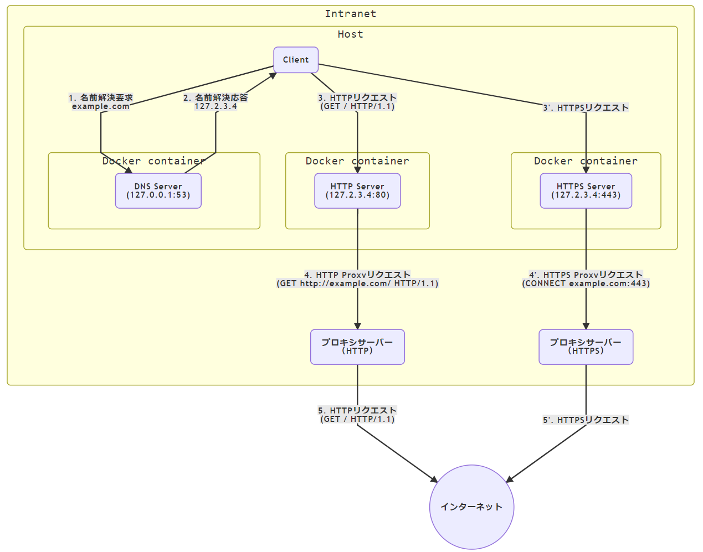

# プロキシ非対応ソフトウェアの通信をプロキシサーバーへ転送
プロキシ非対応ソフトウェアの通信をプロキシサーバーへ転送することでインターネットへアクセスできるようにする

## 特徴
- ローカルマシン単体で動作する
    - 他のネットワーク機器の設定変更は不要
    - ローカルマシンのDNS設定の変更が必要

## 使い方
1. [docker, docker-compose をインストール](https://docs.docker.com/install/#supported-platforms)
1. 設定
    1. 設定ファイルを作成: `.env.example` を `.env` にコピー
        ```sh
        cp .env.example .env
        ```
    1. 設定ファイル `.env` を必要に応じて編集
        - ※ 同名の環境変数が定義されていると、 `.env` での定義より環境変数が優先される
            - ただし、Windowsの場合、小文字が含まれる環境変数は `.env` が優先される可能性がある
        - ※ Docker Machine を使っている場合は、`DNS_SERVER_BIND_IP`, `FORWARDING_SERVER_BIND_IP` には `127.0.0.0/8` のIPではなく、 `docker-machine ip` で得られるIPを設定する必要がある
            ```sh
            # コンテナ内の DNS Server のbindをhost側につなげる際のhost側の待ち受けIP
            DNS_SERVER_BIND_IP=127.0.0.1

            # 転送サーバー(HTTP Server / HTTPS Server)のbind IP (=全ドメインを名前解決するIP)
            FORWARDING_SERVER_BIND_IP=127.2.3.4
            ```
            ```
            $ docker-machine ip
            192.168.99.100
            ```

1. 各種サーバーを起動
    ```sh
    docker-compose up -d
    ```
1. ローカルマシンのDNSサーバーの設定を変更
    - `.env` に書いた `DNS_SERVER_BIND_IP` 変数の値に変更

## 仕組み
1. （HTTPプロキシに対応していない）Clientアプリはローカルで動いているDNSサーバーに名前解決要求を出す
    - ※ DNSサーバーの設定はOS側で変更する必要がある
    - ローカルで動いているDNSサーバーのIP（例）: `127.0.0.1:53`
2. DNSサーバーはすべてのドメイン名をローカルのIPに名前解決する
    - ローカルのIP
        - 設定キー: `FORWARDING_SERVER_BIND_IP`
        - 例: `127.2.3.4`
3. Clientアプリは名前解決で得られたローカルのIPの80/443番ポートにHTTP/HTTPSリクエスト
4. ローカルのIPで動いているHTTP(S)サーバーはプロキシ処理可能なリクエストに変換してからプロキシサーバーへリクエスト
    - HTTP: Host Header から実際の接続先FQDNを取得
    - HTTPS: TLS Handshake の 拡張 (Server Name Indication) から実際の接続先FQDNを取得
5. プロキシサーバーが代理で元のリクエスト先にリクエスト



## 制約
- FQDN（≒ドメイン名）での通信であること
    - IPアドレスでの通信は名前解決がされなく通信に割り込めないため非対応
- リクエスト中に元のリクエスト先FQDNが含まれていること
    - HTTP リクエスト: Host ヘッダーが存在すること
    - HTTPS リクエスト: クライアントが Server Name Indication に対応していること
- ポート番号は各プロトコルのデフォルトであること
    - HTTP リクエスト: `80`
    - HTTPS リクエスト: `443`
