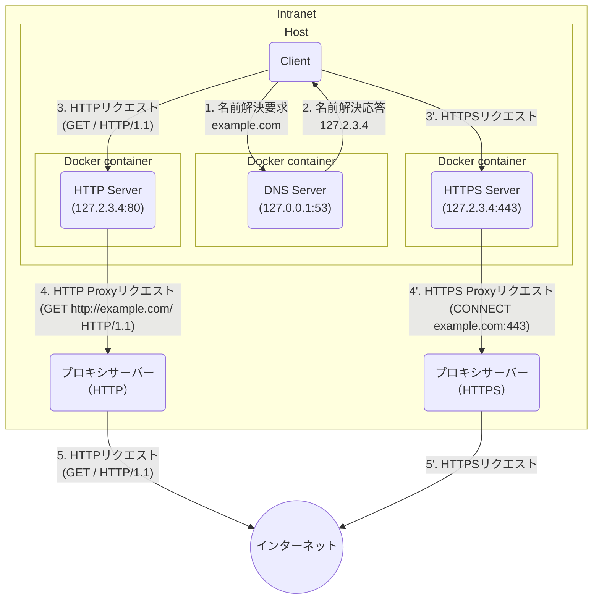

```mermaid
graph TB
internet(("インターネット"))

client
    -- "1. 名前解決要求<br>example.com"
    --> dns_server
dns_server
    -- "2. 名前解決応答<br>127.2.3.4"
    --> client
client
    -- "3. HTTPリクエスト<br>(GET / HTTP/1.1)"
    --> http_server
client
    -- "3'. HTTPSリクエスト"
    --> https_server
http_server
    -- "4. HTTP Proxyリクエスト<br>(GET http://example.com/ HTTP/1.1)"
    --> http_proxy
https_server
    -- "4'. HTTPS Proxyリクエスト<br>(CONNECT example.com:443)"
    --> https_proxy
http_proxy
    -- "5. HTTPリクエスト<br>(GET / HTTP/1.1)"
    --> internet
https_proxy
    -- "5'. HTTPSリクエスト"
    --> internet

subgraph Intranet

    http_proxy("プロキシサーバー<br>（HTTP）")
    https_proxy("プロキシサーバー<br>（HTTPS）")

    subgraph Host
        client("Client")
        subgraph Docker container
            dns_server("DNS Server<br>(127.0.0.1:53)")
        end
        subgraph Docker container
            http_server("HTTP Server<br>(127.2.3.4:80)")
        end
        subgraph Docker container
            https_server("HTTPS Server<br>(127.2.3.4:443)")
        end
    end
end
```
